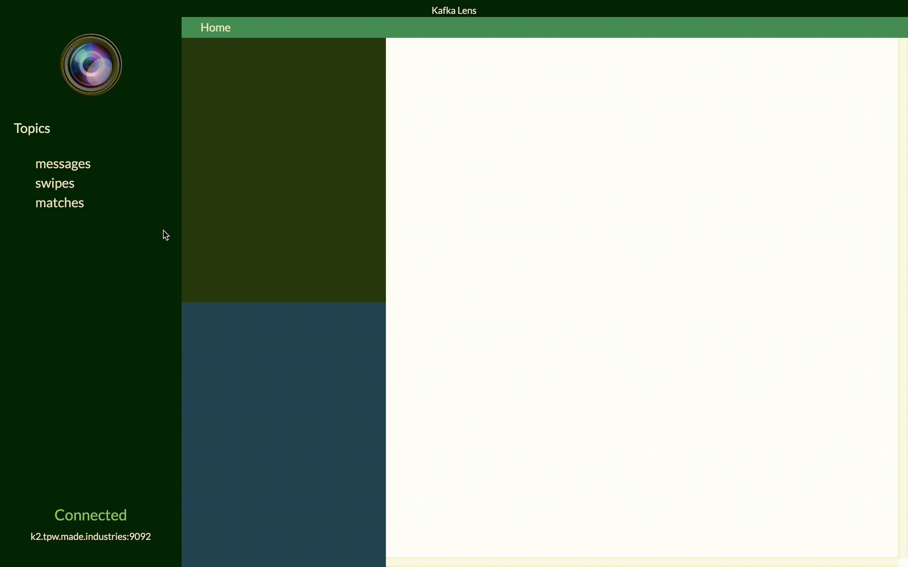

[](https://travis-ci.com/kafka-lens/kafka-lens)


### A visuailization tool for your Kafka cluster

Kafka Lens provides a tool that lets you inspect a Kafka cluster in real-time and allows developers a way to easily troubleshoot issues in the cluster as they occur. Now you can quickly test whether new services are functioning correctly by monitoring how messages are published to Kafka topics and partitions without a CLI or other costly solutions.



## 5 Steps for Quick Startup

**Fork** and **Clone** Repository
```
1. cd into your 'kafka-lens' folder
2. npm install
3. npm run webpack
4. run this script in your command line: './node_modules/.bin/electron-rebuild'
5. npm start
```

### Connecting to Your Broker

Enter the URI of your Kafka broker (e.g. kafka1.contoso.com:9092) then click 'Connect' to connect to your Kafka broker. Once you are connected, you are ready to start consuming messages in real-time. 


## Authors
[Harmon Huynh](https://github.com/iAmHarmon)

[Howard Na](https://github.com/howardNa)

[Jordan Betzer](https://github.com/jordanzobean)
