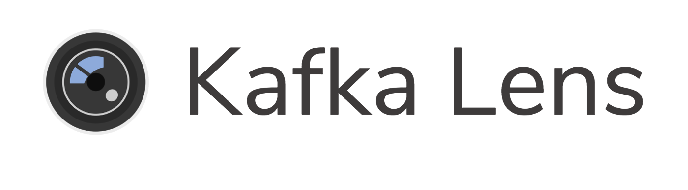

[](https://travis-ci.com/kafka-lens/kafka-lens)


### A visuailization tool for your Kafka cluster

Kafka Lens provides a tool that lets you inspect a Kafka cluster and allows developers a way to easily troubleshoot issues in the cluster as they occur. Now you can quickly test whether new services are functioning correctly by monitoring how messages are published to Kafka topics and partitions without a CLI or costly cloud solutions.


***

## Scripts break-down

**Run in development environment**
```
yarn dev
```
**Run in production environment**
```
yarn start
```

**Build package for linux, windows, or mac *(based on host OS)***
```
yarn package
```

**Lint project**
```
yarn lint
```

***

### Connecting to Your Broker

Enter the URI of your Kafka broker (e.g. kafka1.contoso.com:9092) then click 'Connect' to connect to your Kafka broker. Once you are connected, you are ready to start consuming messages.


## Version 2 Team

[Nahuel Arjona](https://github.com/nahuelarjonadev)

[Brian Kwok](https://github.com/briankwok15)

[Angel Vega](https://github.com/AngelEvelyn)

[Samuel Ho](https://github.com/samueldaraho)

## Authors

[Harmon Huynh](https://github.com/iAmHarmon)

[Howard Na](https://github.com/howardNa)

[Jordan Betzer](https://github.com/jordanzobean)
